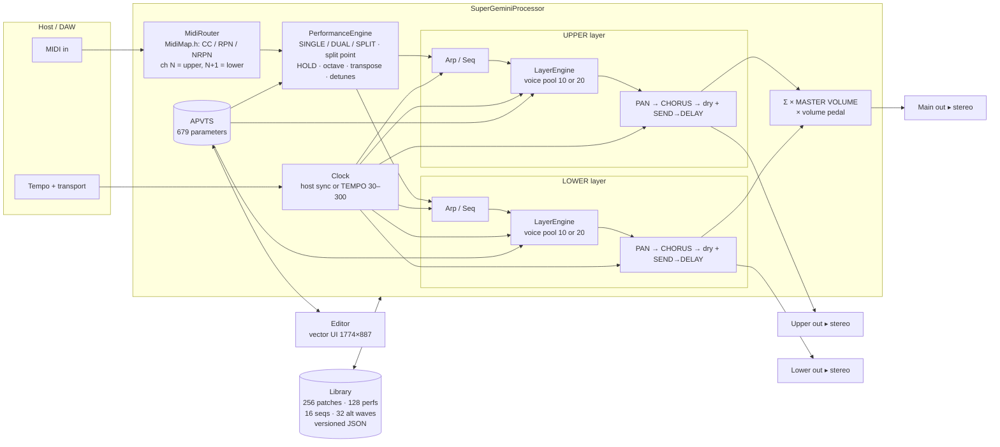
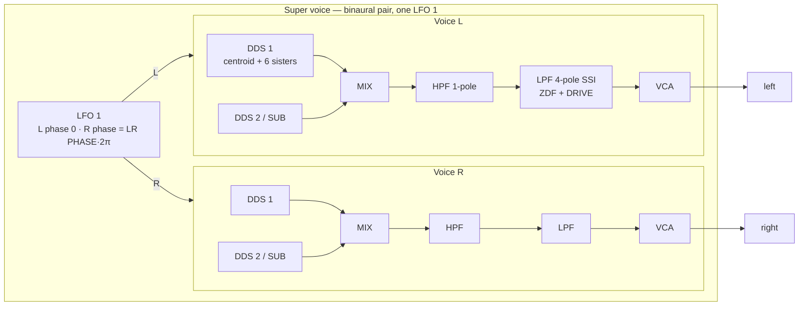

# Super Gemini Plugin — Architecture (Phase 1)

Stack: C++20 · JUCE 8.0.15 · clap-juce-extensions · CMake + Ninja · MSVC 17.14 (Windows). Formats: VST3,
CLAP, Standalone on Windows; AU is configured in CMake but can only be built on macOS.
Tests: JUCE's built-in `juce::UnitTest` in a headless console target, so no extra downloads.

## 1. Module diagram



## 2. Voice structure (one layer)



- **Binaural on**: a super voice renders two complete voices, L and R. The LR PHASE offset feeds LFO 1 into LPF
  cutoff, VCA level, DDS 2 pitch and DDS 2 PW [p.56]. The DDS 1 sisters are spread in stereo by SUPER [p.61].
- **Binaural off**: each voice is mono, panned by SPREAD (alternating hard L/R at max; no panning in SOLO/LEGATO)
  [pp.58, 91]. One LFO 1 is shared by two voices [p.54].
- **Per-voice modulators**: ENV 1, ENV 2, fixed gate / gate+release envelopes, LFO 2 (per voice so the
  matrix can modulate it polyphonically [p.72]), DDS Modulator, 32 matrix destinations, DRIFT plus fixed
  analog tolerances (DD-35).
- **Mod routing inside the voice**: pitch (LFO 1 / ENV 1 → DDS 1/1+2/2 [p.60]; bender and LFO 2 via DEST
  [p.72]; ribbon; portamento per voice, time ∝ interval [p.73]), cross mod DDS 2→DDS 1 (reversed in SYNC,
  extra in RING [p.63]), PWM/WAVE morph [p.62], LFO 1 HF injected into the DDS 1 or DDS 2 channel [p.59].

## 3. DSP approach (Phase 2 details, fixed now so the parameter layout can't paint us into a corner)

| Block | Approach |
|---|---|
| Oversampling | Oscillator + filter stage per voice at 2× (default) / 4× / 8× / 16× (Settings), polyphase half-band decimation. The hardware avoids band-limiting by running far above audio rate [p.xii]; we get the same open top end from band-limited oscillators plus oversampling, not a dull filter. |
| DDS 1 classic waves | 4-point polyBLEP / polyBLAMP (cubic B-spline) saw, square, triangle, all phase-aligned to the sine (DD-36); 7 free-running phases; sister detune and level by SUPER ½/ON (level profile from pp.61–62 spectra). |
| DDS 1 ALT waves | 4096-point tables → mip-map pyramid (512 harmonics at top level [p.109]); crossfade A↔B by PWM/WAVE [p.62]. |
| DDS 1 morph | Crossfade waveform n → n+1 (table p.32), per-sample, band-limited both ends. |
| DDS 2 | Algorithmic polyBLEP; phase reset on note-on [p.35]; SYNC = hard reset on the DDS 1 wrap with a BLEP correction; RING = DDS 1 × DDS 2 in DDS 2's channel [p.36]; LFO range 0.1–100 Hz [p.38]; sub = DDS 1 phase ÷ 2 [p.39]. |
| Cross mod | Exponential FM of DDS 1 by DDS 2 at the oversampled rate [p.63]. |
| HPF | TPT one-pole [p.41]. |
| LPF | 4-pole ZDF ladder, SSI-style (OTA stages, tanh per stage), resonance compensated in DRIVE 1, heavy pre-drive in DRIVE 2 [p.42]. Self-oscillates to a clean sine and tracks the keyboard at KEYTRACK ON [p.42]. |
| VCA | Linear-in-dB envelope gain (T-dB), LFO 1 tremolo, DDS 2 AM [p.45]. |
| Envelopes | Exponential segments; AH/DH hold stages; LOOP A→DH→D between the sustain floor and the peak [p.48]; keytrack scaling (DD-26). |
| LFO 1 | Per super voice; FREE / ONCE / RESET; S&H → noise at max rate [p.59]; HF sine 20 Hz–20 kHz, HF TRK keytracked [p.59]. |
| Chorus | Dual BBD-style modulated delay, stereo: I, II, I+II (ensemble) [p.64]. |
| Delay | Stereo, 1 ms–1 s or synced (Table S2), FEEDBACK at max = unity loop with no loss; FREEZE mutes input and loops at unity [pp.65–67]. |
| Control rate | Parameters smoothed (10 ms) per 32-sample block; pitch / cutoff / shape modulation every 4 samples with per-sample cutoff interpolation; envelopes and VCA every sample (DD-38). |
| Voice steal | 3 ms fade-out on steal, no clicks. |

CPU target: 20 voices + both layers' effects < 15 % of one core at 48 kHz, 2× oversampling. This gets
measured with a headless benchmark in Phase 2 and the default quality adjusted if needed.

## 4. Threading and state

- Audio thread: no locks, no allocation. Parameters are read through cached `std::atomic<float>*` once per
  control block.
- Non-parameter state (sequences, alt-wave tables, patch names, performance slot) is built on the message
  thread and handed to the audio thread through an atomic pointer swap; old objects are freed on the message
  thread.
- Plugin state = the current performance: both patches, embedded alt waves, linked sequences and performance
  parameters, as versioned JSON inside the host chunk. The library lives on disk in the same folder shape as
  the hardware drive [pp.102–103].

## 5. Source layout

```
Vst/
  CMakeLists.txt
  third_party/JUCE, third_party/clap-juce-extensions
  src/
    BrandConfig.h            wordmark + product strings in one place
    PluginProcessor.*        APVTS, buses, state
    params/ParamIDs.h        every ID from PARAMETERS.md
    params/ParameterLayout.* ranges, tapers, defaults (page cite per parameter)
    midi/MidiMap.h           CC / RPN / NRPN table transcribed from pp.116–128
    midi/MidiRouter.*
    engine/PerformanceEngine.*, LayerEngine.*, VoiceAllocator.*, SuperVoice.*, Voice.*
    dsp/Dds1.*, Dds2.*, OnePoleHpf.h, SsiLadder.*, Vca.h, Envelope.*, Lfo.*, Chorus.*, Delay.*, Oversampler.*
    mod/DdsModulator.*, ModMatrix.*
    seq/Clock.*, Arpeggiator.*, Sequencer.*
    storage/Library.*, AltWaveLibrary.*, Settings.*
    ui/                      Phase 5
  tests/                     headless juce::UnitTest runner
  resources/waves, resources/presets
  docs/
```

## 6. Phases and the manual pages each covers

| Phase | Scope | Manual pages |
|---|---|---|
| 1 Plan (this) | Parameter table, module diagram, decisions | all, 14–128 |
| 2 DSP core | Voice, DDS 1/2, mixer, HPF/LPF, VCA, envelopes, LFO 1, DDS Modulator + headless tests | xii–xiii, 30–63 |
| 3 Layers & performance | Voice allocation, binaural, single/dual/split, LFO 2, bender, portamento, octave/transpose/tune, ribbon, detunes, hold, matrix, voice assign | 17–26, 68–91 |
| 4 Effects, arp/seq, MIDI | Chorus, delay, freeze, clock, arpeggiator, sequencer, MidiMap.h, global settings | 64–67, 92–101, 115–128 |
| 5 UI | Mockup-faithful vector UI, §6 mappings, all bindings live | layout: mockup; labels: pp.30–98 |
| 6 Presets, files, QA | Init + 16 demo patches + 8 performances, JSON library, page-by-page QA checklist | 17–26, 102–114 |

## 7. Unverified items carried into Phase 2+

Listed as **UNCLEAR** in manual_notes.md. The ones that affect sound are resolved by DD-8, DD-12, DD-20,
DD-23, DD-24, DD-25, DD-26 and DD-29. None block Phase 2.
